# Crowdfunding_ETL

## Collaborators: 
Shayla Badeaux 
Karoly Burgyan 

---

## Sources: 
Python Tutorial. (n.d.). https://www.w3schools.com/python/ 
Stack Overflow - Where Developers Learn, Share, & Build Careers. (n.d.). Stack Overflow. https://stackoverflow.com/ 
Regex special characters. https://www.w3schools.com/python/python_regex.asp 
For guidance on For/If/Else list comprehension. June 6, 2022. https://stackoverflow.com/questions/4260280/if-else-in-a-list-comprehension 
Starter code given from bootcamp class and instructions 

***
# Creating An ETL Pipeline:
In this project, our team created an ETL pipeline for the ultimate purpose of transforming raw data in the form of .xlsx files into a functioning database with its own schema. 

## Creating the Category, Subcategory, Campaign, and Contacts DataFrames:

Extraction for creating the 'category', 'subcategory', 'campaign', and 'contacts' DataFrames began by reading in raw data from .xlsx files into a general DataFrame.
<ol style='list-style-type: upper-roman;'>
    <li>
        <strong>Creating the Category and Subcategory DataFrames:</strong> 
        The 'category' and 'subcategory' DataFrames were constructed using similar procedures: 
        <ol style='list-style-type: upper-alpha; '>
            <li>
                Extraction 1
                <ol>
                    <li>
                        Use the general DataFrame to extract two new columns by splitting a column (‘category & sub-category’ to ‘category’ and ‘subcategory’).
                    </li>
                </ol>
            </li>
            <li>
                Transformation 1
                <ol>
                    <li>
                        Find the unique values of the 2 columns ('category' and 'subcategory') and assign those unique values to id values ('category_id' and 'subcategory_id') 
                    </li>
                    <li>
                        Create 2 DataFrames from the 2 columns’ unique values and their corresponding id (i.e. a 'category' DataFrame for the columns 'category' and 'category_id' and a 'subcategory' DataFrame for the columns 'subcategory' and 'subcategory_id') 
                    </li>
                </ol>
            </li>
            <li>
                Loading 1
                <ol>
                    <li>
                        These 2 DataFrames ('category' and 'subcategory' DataFrames) were then saved into 2 .csv files.
                    </li>
                </ol>
            </li>
        </ol>
    </li>
     
    <li>
        <strong> Creating the Campaign DataFrame:</strong> 
        The 'campaign' DataFrame was created by transformations to the general pandas.DataFrame (that still remained from creating the 'category' and 'subcategory' DataFrames): 
        <ol style='list-style-type: upper-alpha;'>
            <li>
                Extraction 2
                <ol>
                    <li>
                        Extraction already began when the general DataFrame was loaded in from the .xlsx file (already mentioned above).
                    </li>
                </ol>
            </li>
            <li>
                Transformation 2
                <ol>
                    <li>
                        For readability, rename the columns of general DataFrame.
                    </li>
                    <li>
                        For future data manipulation and readability, convert the datatypes of several columns from int64 to float and int64 to datetime.
                    </li>
                    <li>
                        To create foreign keys in the table to come: 
                        <ul>
                            <li>
                                Merge the category and subcategory DataFrames to the general DataFrame saving the result into a new DataFrame, 
                            </li>
                            <li>
                                Remove extraneous columns of ‘category’ and ‘subcategory’ leaving behind only the ‘category_id’ and ‘subcategory_id’ in the new DataFrame
                            </li>
                        </ul>
                    </li>
                </ol>
            </li>
            <li>
                Loading 2
                <ol>
                    <li>
                    Save this new DataFrame (the 'campaign' DataFrame) to a .csv files.
                    </li>
                </ol>
            </li>
        </ol>
    </li>
    <li>
        <strong>Creating the Contacts DataFrame:</strong> 
        The 'contacts' DataFrame was created in a separate but similar ETL process from the DataFrames as it drew its data from a separate .xlsx file. 
        <ol style='list-style-type: upper-alpha;'>
            <li>
                Extraction 3
                <ol>
                    <li>
                        Extraction for creating the 'contacts' DataFrame began by reading in raw data from another .xlsx file.
                    </li>
                </ol>
            </li>
            <li>
                Transformation 3
                <ol>
                    <li>
                        Transform the initial pandas.DataFrame created from .xlsx by 1) removing the extraneous top row.
                    </li>
                    <li>
                        Reset the index.
                    </li>
                    <li>
                        Rename the column from the blank column name ‘&emsp;&emsp;&emsp;‘ to ‘contact_info’.
                    </li>
                    <li>
                        Creating a new column (‘contact_id’)  populated with data extracted from the original single column using a regular expression.
                    </li>
                    <li>
                        Change the datatype of ‘contact_id’ from ‘object’ to ‘int64’.
                    </li>
                    <li>
                        Create more columns (‘name’, and ‘email’)  populated with data extracted from the original single column using regular expressions.
                    </li>
                    <li>
                        Split the ‘name’ column to create the new columns of ‘first_name’, and ‘last_name’.
                    </li>
                    <li>
                        Remove the extraneous ‘name’ column.
                    </li>
                    <li>
                        Reorder the columns.
                    </li>
                </ol>
            </li>
            <li>
                Loading 3
                <ol>
                    <li>
                        Save this DataFrame (the 'contacts' DataFrame) to a .csv files.
                    </li>
                </ol>
            </li>
        </ol>
    </li>
</li>
</ol>

## Creating A Database From The New .CSV Data Files:

To create a database, the .csv were examined and an Entity-Relationship Diagram was synthesized which led to a schema, and database tables were constructed in postgresql, and, finally, these tables were populated with the data from the .csv files.
<ol style='list-style-type: upper-roman;'>
    <li>
        <strong>Inspect The .csv Files And Create The Schema And Entity-Relationship Diagram:</strong> 
        Inspecting the .csv files led to the synthesis of the following schema:  

            campaign
            --
            cf_id INT PK
            contact_id FK >- contacts.contact_id INT
            company_name VARCHAR(50)
            description VARCHAR(225)
            goal NUMERIC(10,2)
            pledged NUMERIC(10,2)
            outcome VARCHAR(50)
            backers_count INT
            country VARCHAR(50)
            currency VARCHAR(50)
            launched_date DATE
            end_date DATE
            category_id FK >- category.category_id VARCHAR(50)
            subcategory_id FK >- subcategory.subcategory_id VARCHAR(50)

            category
            --
            category_id PK VARCHAR(50)
            category VARCHAR(50)

            contacts
            --
            contact_id PK INT
            first_name VARCHAR(50)
            last_name VARCHAR(50)
            email VARCHAR(50)

            subcategory
            --
            subcategory_id PK VARCHAR(50)
            subcategory VARCHAR(50)
 
        which in turn led to the following ERD built in <a href="https://www.quickdatabasediagrams.com/">QuickDatabaseDiagrams.com</a>:
         
         
         
        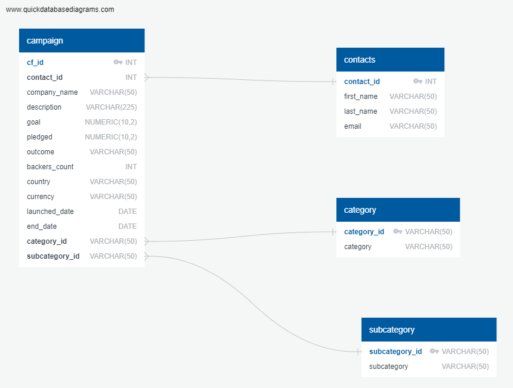
    </li>
     
    <li>
        <strong>Construct Database Tables:</strong> 
        The following postgresql code was run in pgAdmin4:  

        --Create table schema
        CREATE TABLE "category" (
            "category_id" VARCHAR(50) PRIMARY KEY  NOT NULL,
            "category" VARCHAR(50)   NOT NULL
        );
        CREATE TABLE "contacts" (
            "contact_id" INT PRIMARY KEY  NOT NULL,
            "first_name" VARCHAR(50)   NOT NULL,
            "last_name" VARCHAR(50)   NOT NULL,
            "email" VARCHAR(50)   NOT NULL
        );
        CREATE TABLE "subcategory" (
            "subcategory_id" VARCHAR(50) PRIMARY KEY NOT NULL,
            "subcategory" VARCHAR(50)   NOT NULL
        );
        CREATE TABLE "campaign" (
            "cf_id" INT PRIMARY KEY  NOT NULL,
            "contact_id" INT   NOT NULL,
                FOREIGN KEY (contact_id) REFERENCES contacts(contact_id),
            "company_name" VARCHAR(50)   NOT NULL,
            "description" VARCHAR(225)   NOT NULL,
            "goal" NUMERIC(10,2)   NOT NULL,
            "pledged" NUMERIC(10,2)   NOT NULL,
            "outcome" VARCHAR(50)   NOT NULL,
            "backers_count" INT   NOT NULL,
            "country" VARCHAR(50)   NOT NULL,
            "currency" VARCHAR(50)   NOT NULL,
            "launched_date" DATE   NOT NULL,
            "end_date" DATE   NOT NULL,
            "category_id" VARCHAR(50)   NOT NULL,
                FOREIGN KEY (category_id) REFERENCES category(category_id),
            "subcategory_id" VARCHAR(50)   NOT NULL,
                FOREIGN KEY (subcategory_id) REFERENCES subcategory     (subcategory_id)
        );
 
    </li>
    <li>
        <strong>Populate The Database Tables:</strong> 
        The following images show the queries used and the resulting data returned from the tables that were populated by importing the data from the .csv files:  
        Here's the populated 'contacts' table:
         
         
        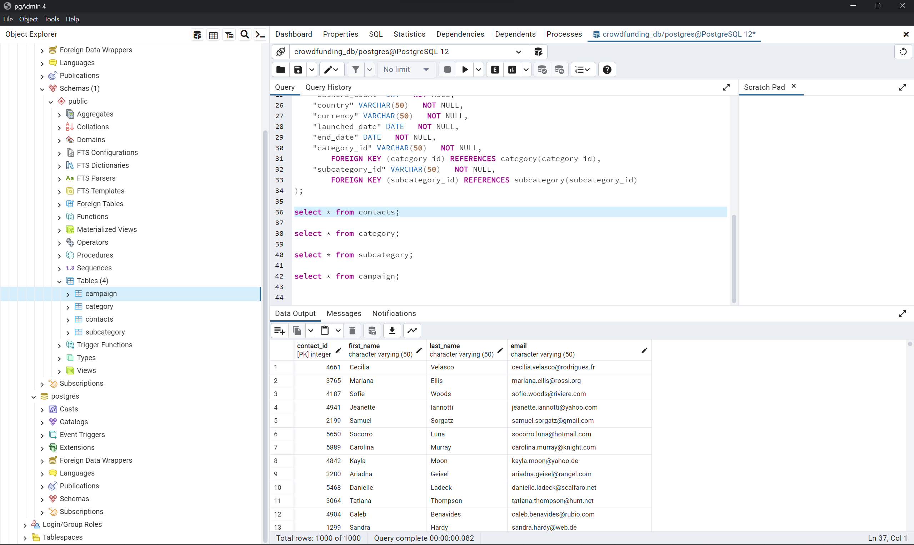
         
         
         
        Here's the populated 'category' table:
         
         
        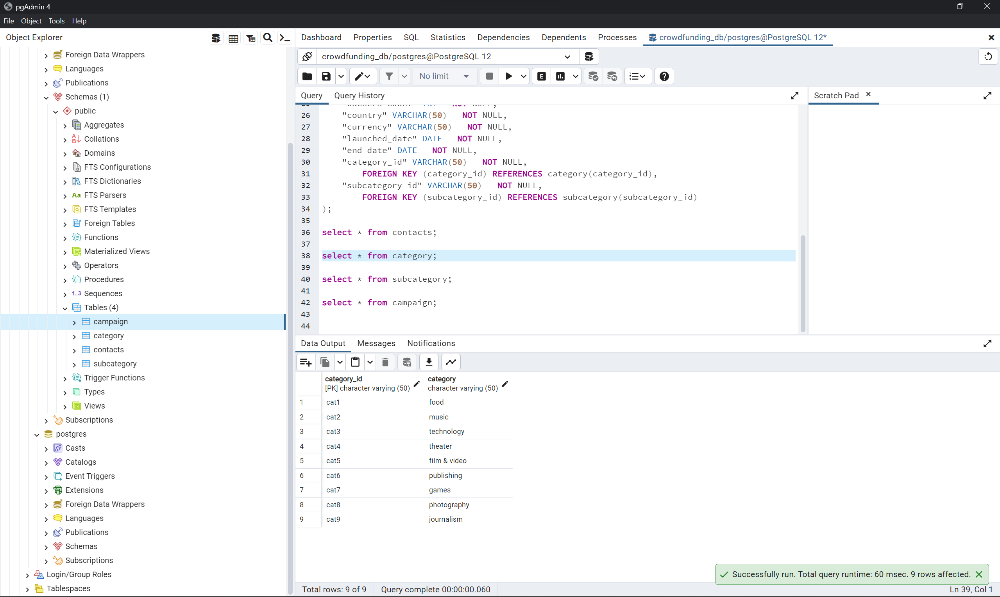
         
         
         
        Here's the populated 'subcategory' table:
         
         
        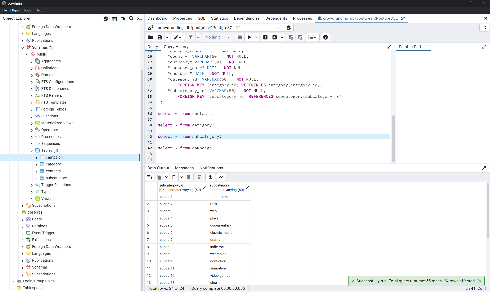
         
         
         
        Here's the populated 'campaign' table:
         
         
        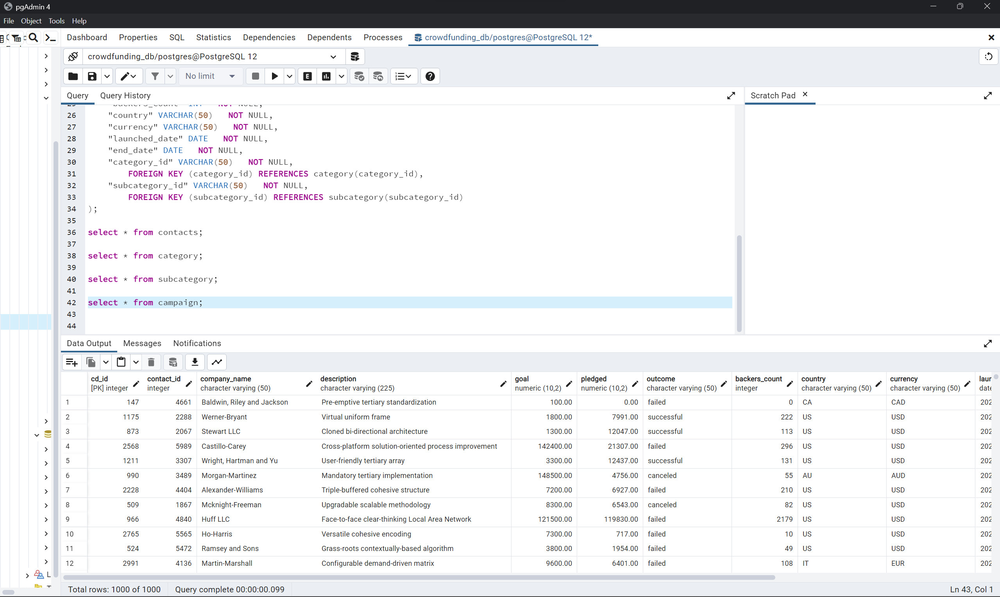
    </li>
</ol>

So, using the ETL pipeline our team took the raw .xlsx data, extracted it, transformed, and loaded it in order to create a simple and functional database in postgresql!

# An Alternative, More Robust Database:
The database created above is simple but it could be more future-proof by:
<ol>
    <li>
        Allowing for a campaign to have multiple contacts.
    </li>
    <li>
        Allowing for a campaign to have multiple categories.
    </li>
    <li>
        Allowing for a campaign to have multiple subcategories.
    </li>
    <li>
        Allowing for a subcategory to be associated with multiple categories--this seems strange at first but we could imagine, for example, a client, that's using the database, wanting the option of ascribing the subcategory "science fiction" not only to the category "film and video" (as it does in the simple database above) but also the category "publishing" because the category "publishing" already includes the subcategory "fiction".
    </li>
</ol>
So, these allowances could be incorporated by making the following changes:
<ol>
    <li>
        Make the relation between the campaign and contacts a many-to-many relationship.
    </li>
    <li>
        Make the relation between the campaign and category a many-to-many relationship.
    </li>
    <li>
        Make the relation between the campaign and subcategory a many-to-many relationship.
    </li>
    <li>
        Make the relation between the subcategory and category a many-to-many relationship.
    </li>
</ol>

## Creating A More Robust Database:
With this goal in mind a new Entity-Relationship Diagram and schema could be created, and a new database could be populated with the data already loaded into the more simple database above.

<ol style='list-style-type: upper-roman;'>
    <li>
        <strong>Create The Schema And Entity-Relationship Diagram:</strong> 
        The new specifications would create the following schema:  

            campaign
            --
            cf_id INT PK
            company_name VARCHAR(50)
            description VARCHAR(225)
            goal NUMERIC(10,2)
            pledged NUMERIC(10,2)
            outcome VARCHAR(50)
            backers_count INT
            country VARCHAR(50)
            currency VARCHAR(50)
            launched_date DATE
            end_date DATE

            category
            --
            category_id PK VARCHAR(50)
            category VARCHAR(50)

            category_campaign
            --
            category_campaign_id PK INT
            category_id FK >- category.category_id VARCHAR(50)
            cf_id INT FK >- campaign.cf_id

            contacts
            --
            contact_id PK INT
            first_name VARCHAR(50)
            last_name VARCHAR(50)
            email VARCHAR(50)

            subcategory
            --
            subcategory_id PK VARCHAR(50)
            subcategory VARCHAR(50)

            subcategory_campaign
            --
            subcategory_campaign_id PK INT
            subcategory_id FK >- subcategory.subcategory_id VARCHAR(50)
            cf_id INT FK >- campaign.cf_id

            contact_campaign
            --
            contacts_campaign_id PK INT
            contact_id FK >- contacts.contact_id VARCHAR(50)
            cf_id INT FK >- campaign.cf_id

            subcategory_category
            --
            subcategory_category_id PK INT
            category_id FK >- category.category_id VARCHAR(50)
            subcategory_id FK >- subcategory.subcategory_id VARCHAR(50)

 
        which in turn leads to the following ERD built in <a href="https://www.quickdatabasediagrams.com/">QuickDatabaseDiagrams.com</a>:
         
         
         
        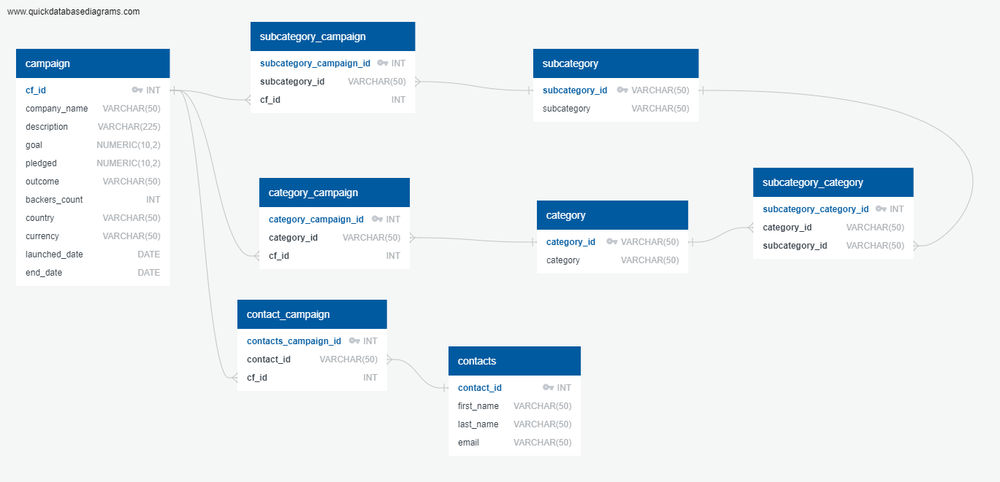
    </li>
     
    <li>
        <strong>Construct And Populate Database Tables:</strong> 
        The following postgresql code was run in pgAdmin4 (note that these first four create table statements are identical to those of the simple database above--this is because they will be used to populate the new tables and will also be transformed):  

        --Create table schema
        CREATE TABLE "category" (
            "category_id" VARCHAR(50) PRIMARY KEY  NOT NULL,
            "category" VARCHAR(50)   NOT NULL
        );
        CREATE TABLE "contact" (
            "contact_id" INT PRIMARY KEY  NOT NULL,
            "first_name" VARCHAR(50)   NOT NULL,
            "last_name" VARCHAR(50)   NOT NULL,
            "email" VARCHAR(50)   NOT NULL
        );
        CREATE TABLE "subcategory" (
            "subcategory_id" VARCHAR(50) PRIMARY KEY NOT NULL,
            "subcategory" VARCHAR(50)   NOT NULL
        );
        CREATE TABLE "campaign" (
            "cf_id" INT PRIMARY KEY  NOT NULL,
            "contact_id" INT   NOT NULL,
                FOREIGN KEY (contact_id) REFERENCES contact(contact_id),
            "company_name" VARCHAR(50)   NOT NULL,
            "description" VARCHAR(225)   NOT NULL,
            "goal" NUMERIC(10,2)   NOT NULL,
            "pledged" NUMERIC(10,2)   NOT NULL,
            "outcome" VARCHAR(50)   NOT NULL,
            "backers_count" INT   NOT NULL,
            "country" VARCHAR(50)   NOT NULL,
            "currency" VARCHAR(50)   NOT NULL,
            "launched_date" DATE   NOT NULL,
            "end_date" DATE   NOT NULL,
            "category_id" VARCHAR(50)   NOT NULL,
                FOREIGN KEY (category_id) REFERENCES category(category_id),
            "subcategory_id" VARCHAR(50)   NOT NULL,
        FOREIGN KEY (subcategory_id) REFERENCES subcategory     (subcategory_id)
        );

        SELECT * FROM category;
        SELECT * FROM subcategory;
        SELECT * FROM contact;
        SELECT * FROM campaign;

        CREATE TABLE contact_campaign(
	        contact_id INT NOT NULL,
	        FOREIGN KEY (contact_id) REFERENCES contact(contact_id),
            cf_id INT NOT NULL,
	        FOREIGN KEY (cf_id) REFERENCES campaign(cf_id),
	        PRIMARY KEY (contact_id, cf_id)
        );

        CREATE TABLE category_campaign(
	        category_id VARCHAR(50) NOT NULL,
	        FOREIGN KEY (category_id) REFERENCES category(category_id),
            cf_id INT NOT NULL,
	        FOREIGN KEY (cf_id) REFERENCES campaign(cf_id),
	        PRIMARY KEY (category_id, cf_id)
        );

        CREATE TABLE subcategory_campaign(
	        subcategory_id VARCHAR(50) NOT NULL,
	        FOREIGN KEY (subcategory_id) REFERENCES subcategory(subcategory_id),
            cf_id INT NOT NULL,
	        FOREIGN KEY (cf_id) REFERENCES campaign(cf_id),
	        PRIMARY KEY (subcategory_id, cf_id)
        );

        CREATE TABLE subcategory_category(
	        subcategory_id VARCHAR(50) NOT NULL,
	        FOREIGN KEY (subcategory_id) REFERENCES subcategory(subcategory_id),
            category_id VARCHAR(50) NOT NULL,
	        FOREIGN KEY (category_id) REFERENCES category(category_id),
	        PRIMARY KEY (subcategory_id, category_id)
        );

        INSERT INTO contact_campaign (contact_id, cf_id)
        SELECT DISTINCT contact_id, cf_id
        FROM campaign;

        INSERT INTO category_campaign (category_id, cf_id)
        SELECT DISTINCT category_id, cf_id
        FROM campaign;

        INSERT INTO subcategory_campaign (subcategory_id, cf_id)
        SELECT DISTINCT subcategory_id, cf_id
        FROM campaign;

        INSERT INTO subcategory_category (subcategory_id, category_id)
        SELECT subcategory.subcategory_id, category.category_id
        FROM subcategory
        JOIN (
        SELECT DISTINCT subcategory_id, category_id
        FROM campaign
        ) AS sub_cat
        ON sub_cat.subcategory_id = subcategory.subcategory_id
        JOIN category
        ON sub_cat.category_id = category.category_id;

 
Because the population process and images are identical for these first 4 create tables, the images showing their population will be skipped here (refer to the images above in the simple database section). 
Carrying on, there are 4 more tables to show their population:  
        Here's the populated 'contact_campaign' table:
         
         
        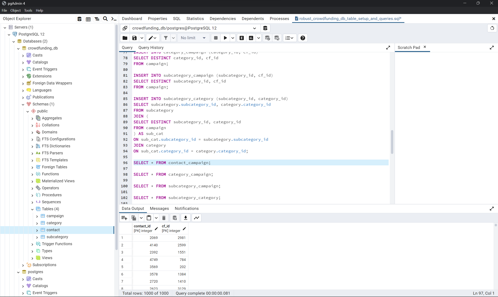
         
         
         
        Here's the populated 'category_campaign' table:
         
         
        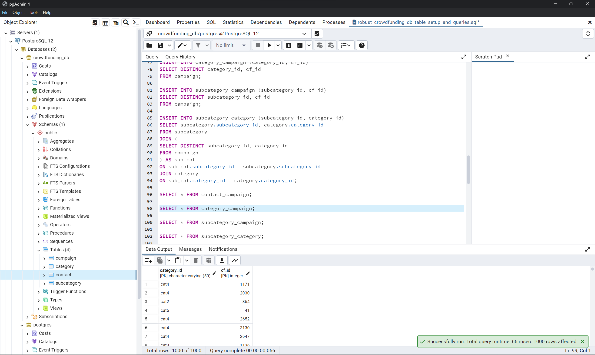
         
         
         
        Here's the populated 'subcategory_campaign' table:
         
         
        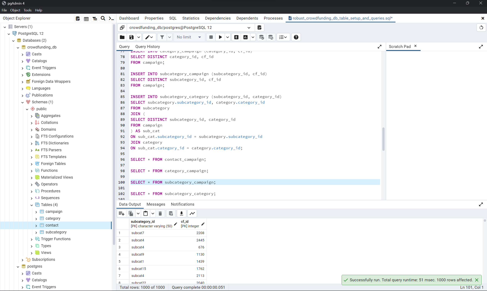
         
         
         
        Here's the populated 'subcategory_category' table:
         
         
        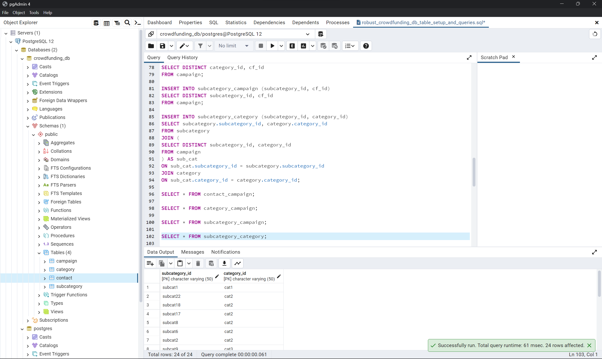
         
         
         
        Here's a query that shows the dropping of columns 'subcategory_id' and 'category_id':
         
         
        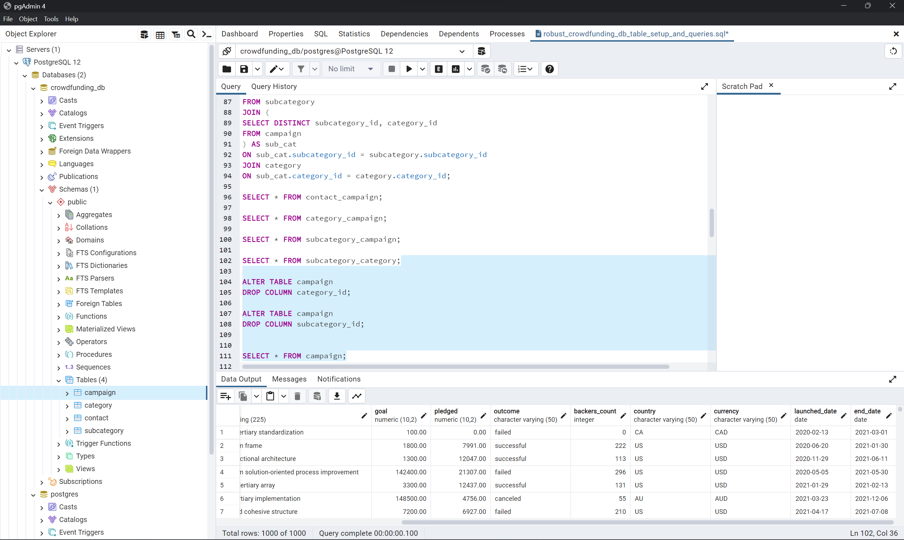
         
         
         
        Here's a query that shows the dropping of column 'contact_id':
         
         
        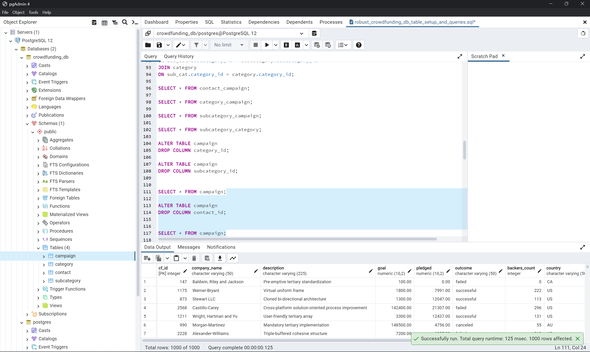
         
         
         
        Here's a query that traverses the tables going from 'campaign' to 'subcategory_campaign' to 'subcategory' to 'subcategory_category' to 'category':
         
         
        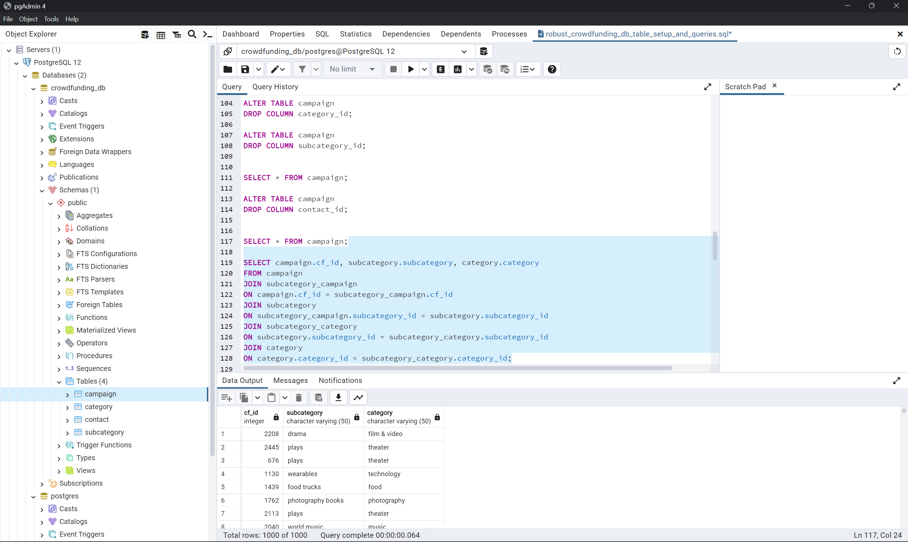
         
         
         
        Here's a query that traverses the tables going from 'campaign' to 'category_campaign' to 'category' to 'subcategory_category' to 'subcategory':
         
         
        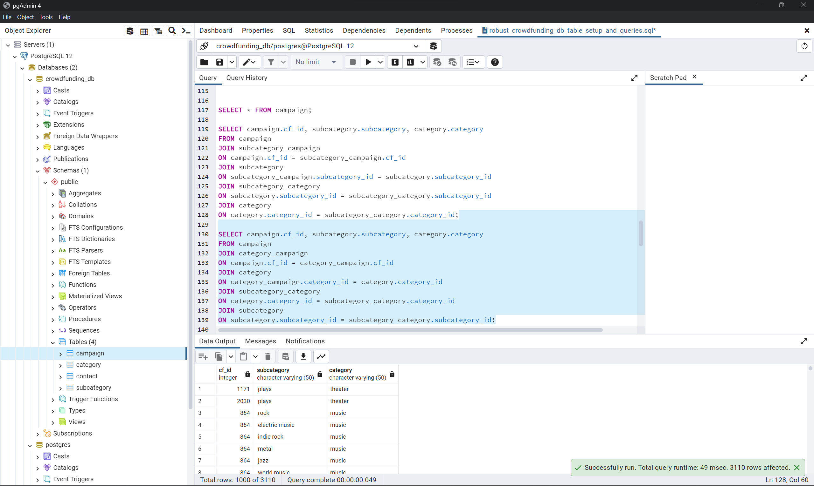
         
         
         
        Here's a query that traverses the tables going from 'campaign' to 'contact_campaign' to 'contact':
         
         
        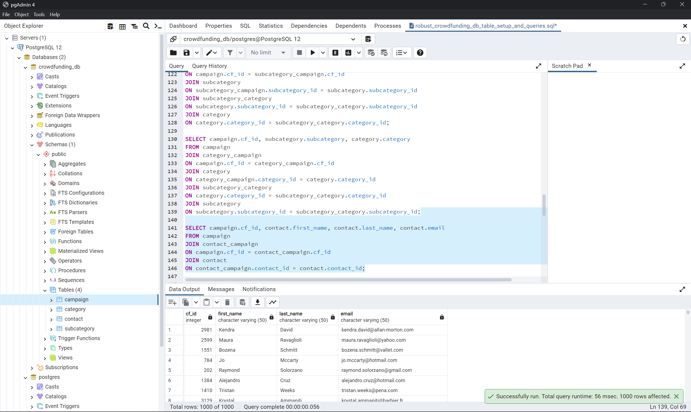
    </li>
</ol>

## Interesting Findings Using The Alternative Database:
Here, queries were created to answer four questions:
<ol>
    <li>
        Which country pledged the most?
         
         
        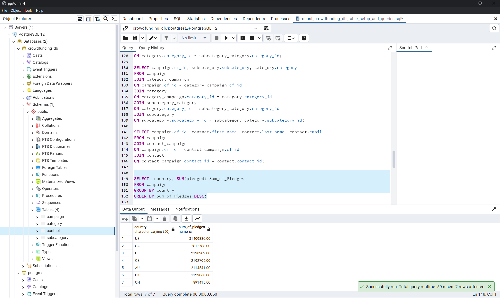
         
         
         
    </li>
    <li>
        Which country started the most campaigns?
         
         
        
         
         
         
    </li>
    <li>
        Which country started the most successful total campaigns?
         
         
        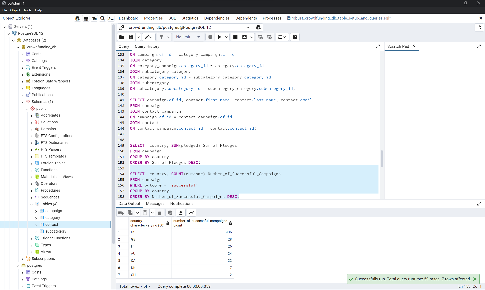
         
         
         
    </li>
    <li>
        Which country was the most realistic with their campaign goals (succeeded most frequently)?
         
         
        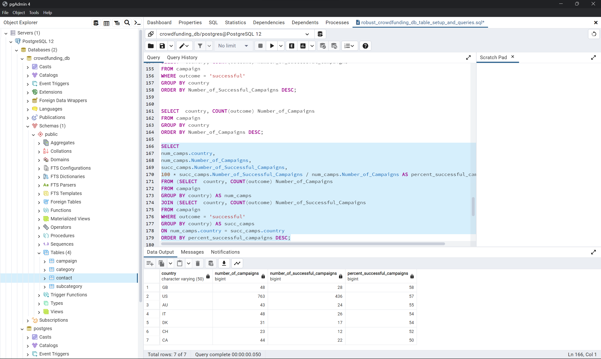
         
         
         
    </li>
</ol>

So, as can be seen the alternative database works nicely and it IS future-proofed!!! And is adequate for many more scenarios than the simple database.
